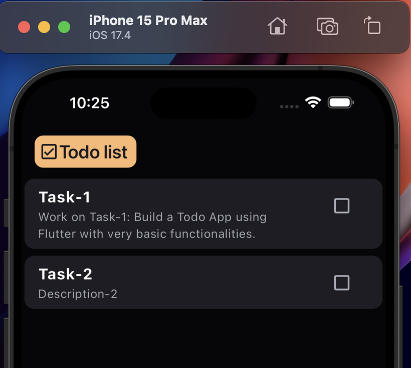
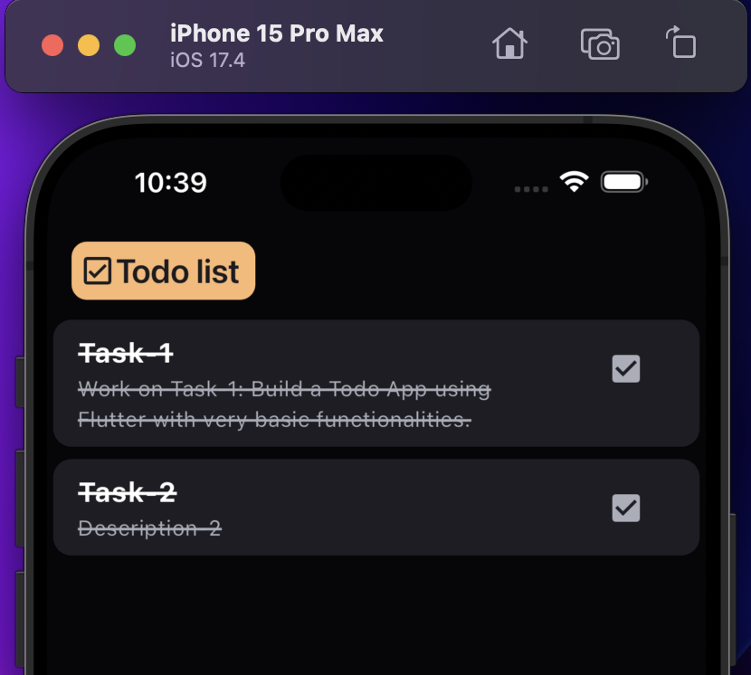
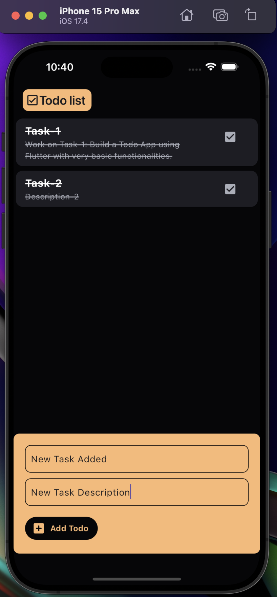
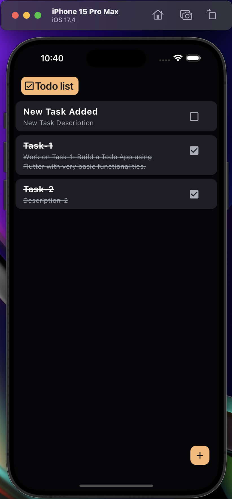

# Todo List App

This is a simple todo app built using Flutter. It allows users to create new todo items and mark them as complete.

## Features

- App displays all the todos in List Tile
- Create new todo items with a title and description.
- Mark todo items as completed (Checkbox and Texxtthrough decoration).

## Installation

To run this app on your local machine, follow these steps:

1. Ensure you have Flutter installed. If not, follow the [installation instructions](https://flutter.dev/docs/get-started/install) on the Flutter website.
2. Clone this repository to your local machine.
3. Open the project in your preferred IDE or editor.
4. Run `flutter pub get` to install the dependencies.
5. Run the app using `flutter run`.

## Screenshots

{ width=450 height=400 }
{ width=450 height=400 }
{ width=430 height=900 }
{ width=430 height=900 }

## Dependencies

- `flutter/material.dart`: Flutter's Material Design widgets.
- [Add any other dependencies used in your project]

## Contributing

Contributions are welcome! If you find any bugs or have suggestions for improvements, feel free to open an issue or submit a pull request.
